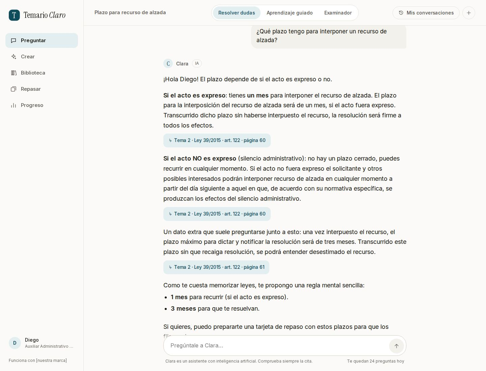
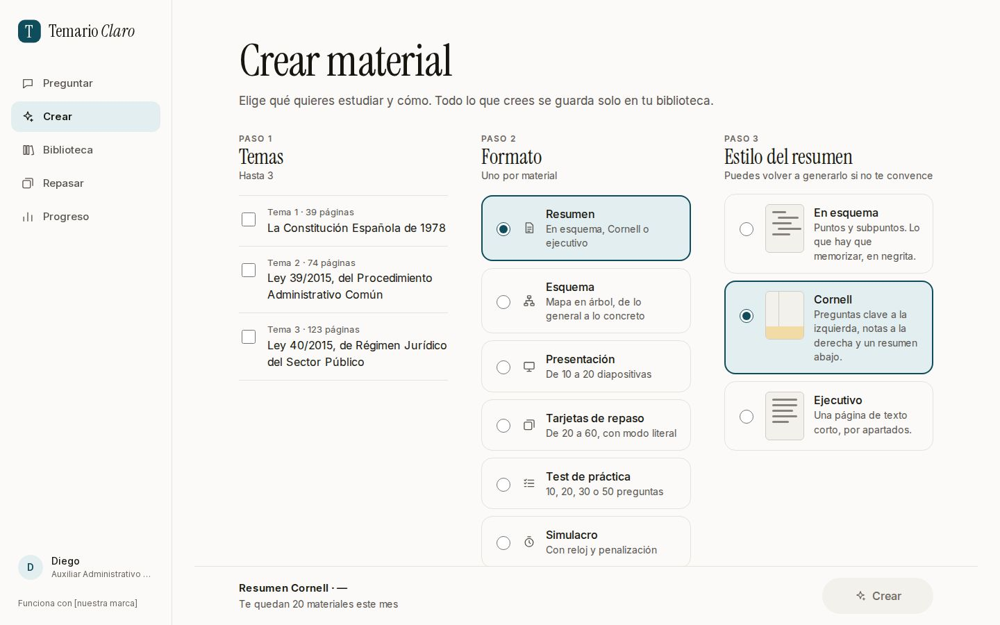
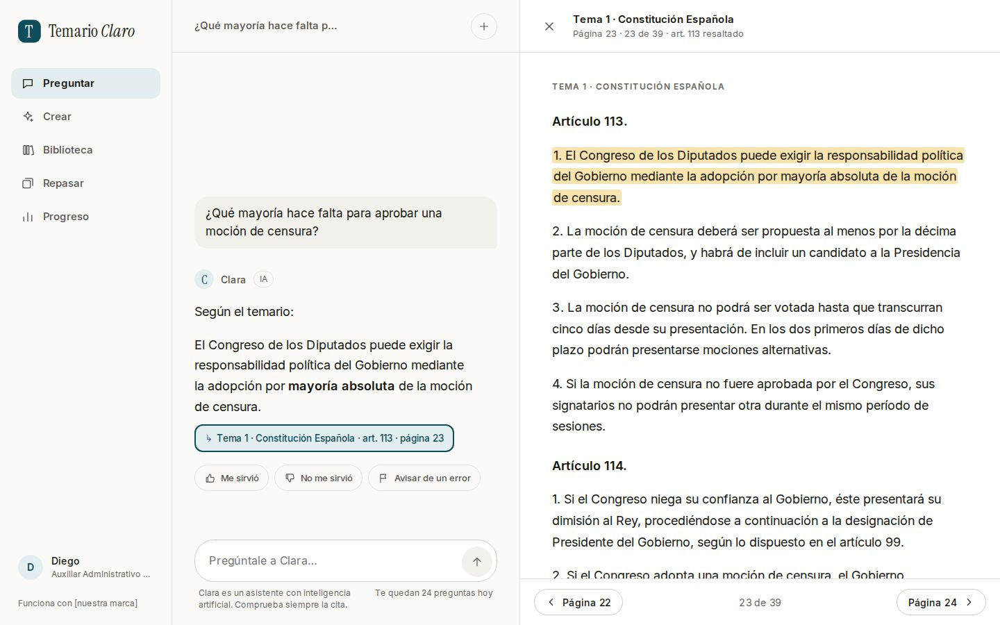
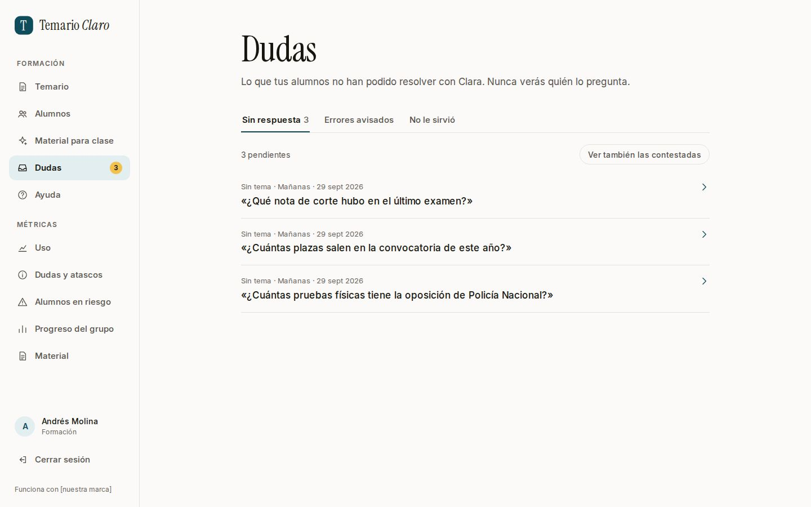
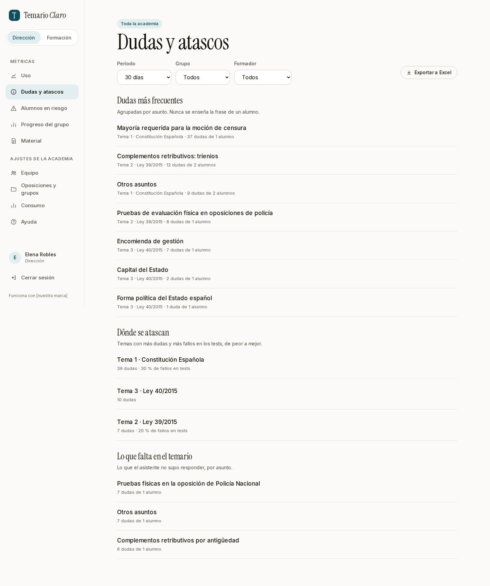

# Asistente de estudio con IA para academias de oposiciones

**Plantilla de marca blanca.** Cada academia tiene su asistente, con su temario
y su marca. El alumno pregunta a cualquier hora y el asistente contesta **solo
con el temario de su academia, citando el tema, el artículo y la página**. Si la
respuesta no está en el temario, lo dice y no se inventa nada.



Hecho con Claude Code en los Workshops Técnicos de Revolutia («Academias 1 y 2
de 2», septiembre de 2026) y terminado después de la segunda clase. Está todo
construido y probado; lo que haces tú es instalarlo, ponerle tu marca y
montárselo a academias.

---

## Qué hace

**Para el alumno** (sobre todo desde el móvil):

- **Pregunta y recibe la respuesta con su cita.** Al pulsar la cita se abre la
  página exacta del temario con el párrafo resaltado.
- **Tres modos:** resolver dudas, aprendizaje guiado (le lleva paso a paso) y
  examinador (le pregunta él y le corrige).
- **Crea su material** a partir del temario: resúmenes (esquema, Cornell y
  ejecutivo), esquemas, presentaciones, tarjetas, tests y simulacros con la
  penalización de su examen. Todo con citas y guardado en su biblioteca.
- **Repasar hoy y Mi progreso:** las tarjetas que tocan cada día y la evolución
  de sus notas, que solo ve él.
- **Se acuerda de cada alumno** («Lo que sé de ti»): qué le cuesta y qué
  domina. El alumno lo ve, lo corrige y lo borra cuando quiere.

**Para el formador:** sube el temario en PDF, invita alumnos con una hoja de
cálculo, crea material para clase y contesta las dudas que el asistente no pudo
resolver (sin ver nunca quién las hizo).

**Para la dirección de la academia:** métricas siempre sumadas (uso, dudas más
frecuentes, dónde se atascan, alumnos que llevan días sin entrar), el equipo,
los grupos y el consumo del mes.

**Para ti, como proveedor:** un panel técnico con el coste de la IA, los
límites de cada academia y un modo soporte de solo lectura que avisa a la
dirección cada vez que entras.

| | |
|---|---|
|  |  |
|  |  |

**Todas las pantallas, con qué hace cada una:** abre
[docs/pantallas/index.html](docs/pantallas/index.html) en el navegador.

---

## Instalarlo con Claude

No hace falta saber programar. Necesitas VS Code con la extensión **Claude
Code** y un plan de pago de Claude. Abre una carpeta vacía (por ejemplo,
`Documentos/Proyectos`), abre el panel de Claude y pega esto:

```
Quiero instalar la plantilla del asistente de estudio con IA para academias de
oposiciones que está en https://github.com/alejandro1234-99/tutor-ia-academias-plantilla

No sé programar: háblame en español llano, sin jerga, y ve paso a paso.

1. Lee INSTALAR.md en
   https://github.com/alejandro1234-99/tutor-ia-academias-plantilla/blob/main/INSTALAR.md
   y sigue sus pasos en orden, empezando por el paso 0.
2. Antes de cada paso, dime en una línea qué vas a hacer, cuánto suele tardar y
   qué puede salir mal. Al terminarlo, espera a que yo escriba «sigue».
3. Nunca me pidas claves ni contraseñas por el chat: dime en qué archivo y en
   qué línea pegarlas, y yo lo hago.
4. Si me pierdo, escribiré «para»: resúmeme en tres líneas dónde estamos.
```

Claude te guía en los pasos de [INSTALAR.md](INSTALAR.md): preparar el
ordenador, crear tu copia privada, la base de datos en París, las claves, la
academia de ejemplo funcionando en tu ordenador y, si quieres, publicarla.

**Lo que necesitas:** cuentas en GitHub, Supabase y Anthropic (gratis o casi
para probar; la IA cuesta unos 3 céntimos por pregunta). Para montarlo a una
academia de verdad, además Vercel, Resend y el dominio de la academia. El
detalle, con precios, está en [INSTALAR.md](INSTALAR.md#lo-que-vas-a-necesitar).

### Si ya sabes lo que haces

1. Pulsa **«Use this template»** arriba a la derecha (o
   `gh repo create mi-copia --template alejandro1234-99/tutor-ia-academias-plantilla --private --clone`).
2. `npm ci` · `cp .env.example .env.local` y rellénalo (base de datos de
   Supabase en París, por el «Transaction pooler»).
3. `npm run db:migrar` · `npm run db:datos-prueba` · `npm run dev`
4. Abre http://localhost:3000 y entra con `diego@example.com`. Con
   `MODO_PRUEBAS=1`, el enlace para entrar sale en
   http://localhost:3000/pruebas/buzon.

Para publicarlo, importa tu copia en Vercel con las variables de
`.env.example`, o usa el botón (crea otra copia del repositorio en tu GitHub y
el proyecto en Vercel de una vez; la base de datos se prepara antes con
`npm run db:migrar`):

[](https://vercel.com/new/clone?repository-url=https%3A%2F%2Fgithub.com%2Falejandro1234-99%2Ftutor-ia-academias-plantilla&project-name=tutor-ia-academias&repository-name=tutor-ia-academias&env=ACADEMIA,URL_WEB,DATABASE_URL,ANTHROPIC_API_KEY,RESEND_API_KEY,CORREO_REMITENTE,CORREOS_TECNICOS,CRON_SECRET&envDescription=Lo%20que%20es%20cada%20una%20est%C3%A1%20en%20.env.example&envLink=https%3A%2F%2Fgithub.com%2Falejandro1234-99%2Ftutor-ia-academias-plantilla%2Fblob%2Fmain%2F.env.example)

---

## Montárselo a una academia

Cuando una academia dice que sí, [MONTAR-CLIENTE.md](MONTAR-CLIENTE.md) lo deja
funcionando en un día: lo que hay que pedirle antes (contrato, marca, temario en
PDF con texto, las 50 dudas típicas de sus alumnos, la lista de alumnos), los
seis pasos del día con sus tiempos y la lista final de entrega. Dile a Claude:
«Vamos a montar la academia <nombre> siguiendo MONTAR-CLIENTE.md».

**Cada academia es una copia aparte:** su repositorio, su base de datos, su
dirección web y su archivo de configuración (`academias/<academia>/configuracion.jsonc`).
Nada de una academia concreta está escrito en el código.

**Cómo se vende (orientativo):** un alta de 750 € y una cuota de 299 € al mes
con 50 alumnos. Según el cálculo del producto, la IA y las herramientas cuestan
entre 96 € y 174 € al mes por academia, según el uso; medida con la IA real, cada
pregunta sale algo más cara de lo calculado (unos 3 céntimos en vez de 2). Las
cuentas completas están en [SOLUCION.md](SOLUCION.md), secciones 7 y 29.

---

## Cómo está probado

- **49 de 50 dudas típicas bien respondidas con la IA real**, revisadas una a
  una, ninguna inventada, y las 5 preguntas de fuera del temario rechazadas.
- **El buscador trae la página correcta en 49 de 50 dudas** (46 de 50 solo con
  búsqueda por palabras, sin Voyage).
- **8 tipos de material** probados con la IA real: de 19 a 79 segundos y de 11
  a 18 céntimos cada uno.
- **Revisión de seguridad:** un alumno no ve lo de otro, el formador y la
  dirección no ven preguntas, notas ni memoria de nadie, y las claves no llegan
  al navegador.
- **El robot de pruebas** (`npm run pruebas`) recorre entrar, preguntar, crear
  material, tests, formador, métricas, correos, límites y seguridad.

---

## Los documentos

| Documento | Para qué |
|---|---|
| [INSTALAR.md](INSTALAR.md) | De cero a la app funcionando. Lo sigue Claude contigo |
| [MONTAR-CLIENTE.md](MONTAR-CLIENTE.md) | Montársela a una academia en un día |
| [SOLUCION.md](SOLUCION.md) | Qué hace el producto, pantalla por pantalla, con sus reglas, sus costes y sus criterios de aceptación. Es el documento que manda |
| [PLAN.md](PLAN.md) | Cómo se construyó, en 21 capas (histórico) |
| [PROMPT-CLAUDE-DESIGN.md](PROMPT-CLAUDE-DESIGN.md) y [diseno/](diseno/README.md) | El encargo de diseño y el diseño de partida |
| [EMPEZAR-AQUI.md](EMPEZAR-AQUI.md) | Para retomar el proyecto otro día |
| [GLOSARIO.md](GLOSARIO.md) | Las palabras raras, con ejemplos |
| [CLAUDE.md](CLAUDE.md) | Las normas que lee Claude al abrir el proyecto |

**Con qué está hecho:** Next.js 16, React 19, Postgres en Supabase (París) con
búsqueda por palabras y por significado, Claude de Anthropic, Voyage AI
(opcional), Resend, Vercel y Playwright.

---

## Permiso de uso

Los alumnos de Revolutia pueden usar este proyecto, cambiarlo y vendérselo a
sus propios clientes. El temario de ejemplo son textos legales públicos del
BOE, y las academias, personas y datos de ejemplo son inventados.
